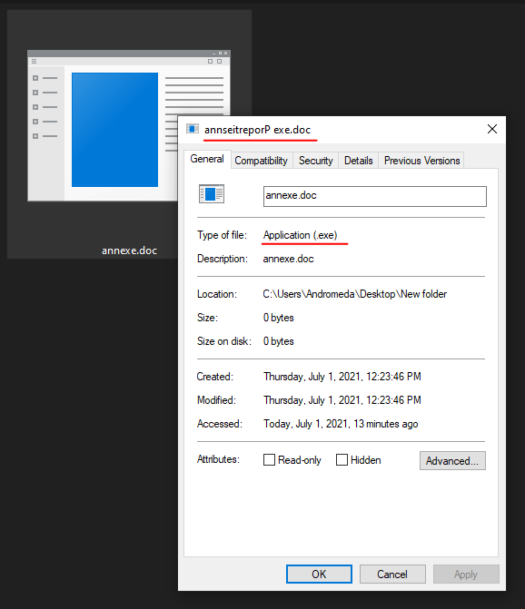

# Right To Left Override attacks

**DISCLAIMER**

#### THIS ARTICLE IS INTENDED FOR EDUCATIONAL PURPOSE **ONLY**.
#### I will not be responsible for any action performed by any reader. If you plan to use the content for illegal purposes, be aware that you can and will be held accountable by the law!

A little known method of spoofing malicious files as harmless ones is provided by a special
[Unicode](https://en.wikipedia.org/wiki/Unicode) invisible character known as **Right To Left Override** 
(RLO). This character was originally intended for providing support for languages that are written 
from right to left, such as Arabic. It basically renders all the text that follows after it in a 
mirrored way, reversing its direction.

Let's say that, for instance, you have a file named **anncod.exe** that represents your malicious 
payload. By inserting the RLO character after the second **n** letter, your filename suddenly gets 
renamed as **annexe.doc**, because all the text that follows after the RLO character gets reversed
and mirrored:

and then, the result:

Note: if your file does not display the new filename after renaming it, hit the F5 key, or right 
click and chose "Refresh".

If the spoofed executabile is also compiled with a pdf or notepad icon, it looks even more 
convincing. The attacker might even code the executable so that in addition of delivering a malicious
payload, it also opens the real Notepad, passing as command line argument a text to be displayed.
To an untrained eye, this would appear to be no different than opening a normal text file.

The RLO character can be copied from this [page](https://unicode.flopp.net/c/202E).

Written for **#cyber-security** Discord channel by *LadyYulia*.